# IHP__CDR4176: Design & Verification Workflow

This document provides an overview of the design metrics and verification strategy applied to the 5-bit 4-Quadrant Phase Interpolator (PI) IP in the IHP SG13G2 technology.

---

## 1. Design Scope & Verification Strategy

The primary focus of this project was the **Phase Interpolator (PI)** core and its associated control logic. Design resources—specifically literature research, topology iteration, and verification efforts—were predominantly directed toward optimizing this block, where **phase linearity (INL/DNL) and circuit bandwidth** served as the primary performance metrics. 

The hardware verification platform, comprising the **Ring Oscillator** and **Frequency Divider**, was implemented primarily to enable end-to-end evaluation within the allocated timeframe. For this platform, the main design objectives were ensuring **acceptable quadrature alignment ($90^\circ$ separation) across the four generated clocks** and providing **sufficient drive capability** to reliably interface with the Phase Interpolator inputs. Consequently, design iterations and characterization cycles were heavily weighted toward the Phase Interpolator core.

Power consumption and silicon area occupation were treated as secondary considerations and were not specifically optimized for the layout submitted in this tapeout edition.

Current-steering phase interpolation is inherently sensitive to layout-induced parasitic capacitances and resistances, which directly degrade both **phase linearity (INL/DNL)** and **circuit bandwidth**. Consequently, while pre-layout simulations provided an initial baseline for component sizing, **the performance metrics and validation results presented in this project were extracted directly from Post-Layout (PEX) simulations**.

---

## 2. Testbench Methodology & Results

To thoroughly characterize the IP, two distinct post-layout testbenches were implemented using identical digital control sequences and evaluating the same output performance metrics: **functional step progression, phase linearity (INL and DNL), and dynamic power consumption**.

The primary distinction lies in the input clock generation method:

* **Testbench 1 (Ideal Clocks):** Uses ideal voltage sources operating at ~730 MHz, passed through the same output inverter buffer chain used by the Ring Oscillator. This guarantees matching input rise/fall times, isolating the core's intrinsic performance.
* **Testbench 2 (Integrated Ring Oscillator):** Driven directly by the multi-phase clock signals generated on-chip by the Ring Oscillator (~730 MHz). This enables system-level evaluation to quantify non-linearities introduced by quadrature mismatch. The frequency divider was omitted from this testbench due to excessive simulation runtimes.

Additionally, both testbenches instantiate two identical post-layout instances operating in parallel to establish a relative phase reference:
* **Dynamic Instance:** Sweeps sequentially across all 32 phase steps (from `5{1'b0}` to `5{1'b1}`) to characterize phase progression.
* **Static Reference Instance:** Held permanently at the initial phase state (`5{1'b0}`, corresponding to full weight on phase $0^\circ$ or `8I`) to serve as a stable phase reference baseline.

Relative phase shift and linearity metrics ($\Delta \Phi$, INL, and DNL) are extracted by measuring the dynamic instance's output transitions directly against the constant-phase output of the static reference instance. Schematic block diagrams illustrating the setup for both testbenches are shown below:

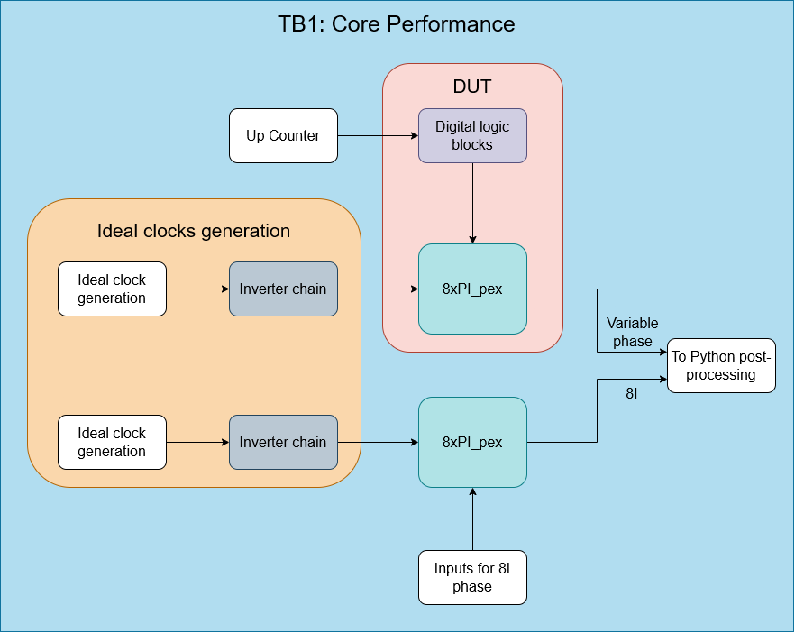  &nbsp;&nbsp;&nbsp; 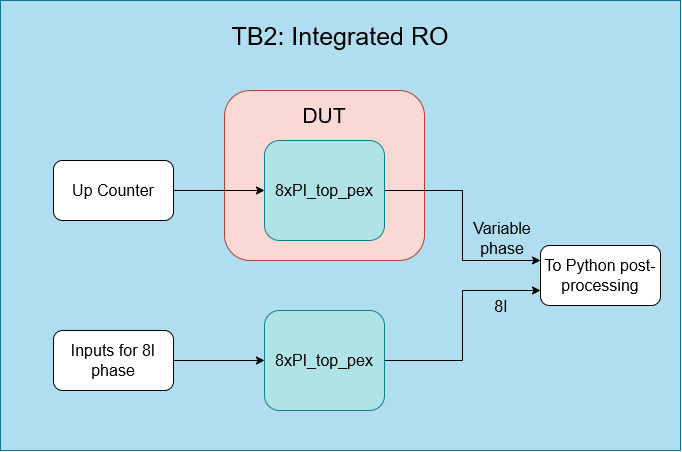

### 2.1. TB 1: Simulation results

To reproduce this results, simulate the `tb_8xPI_pex.sch` testbench to obtain the `tran_linearity_8xPI_pex.raw` output file. Afterwards, run the `results_tb_8xPI.ipynb` Jupyter Notebook to generate the curves.  

<table border="0" align="center" style="border: none; border-collapse: collapse;">
  <tr>
    <!-- Columna 2, Fila 1: Primera imagen cuadrada -->
    <td align="right" valign="bottom" style="border: none; padding-bottom: 10px;">
      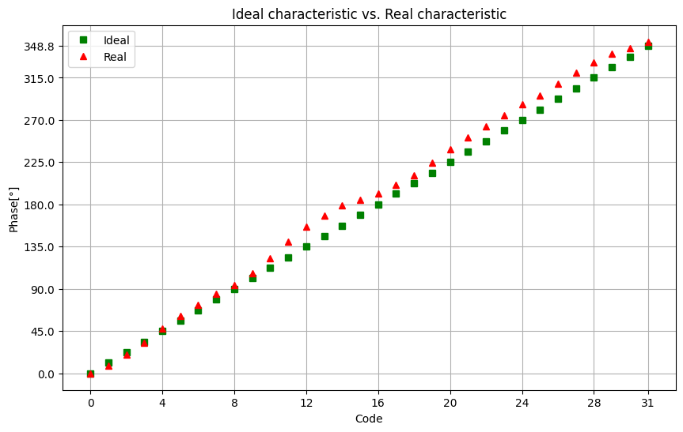
    </td>
    <!-- Columna 1: Imagen alargada verticalmente (Ocupa Filas 1 y 2) -->
    <td rowspan="2" align="left" valign="middle" style="border: none; padding-right: 10px;">
      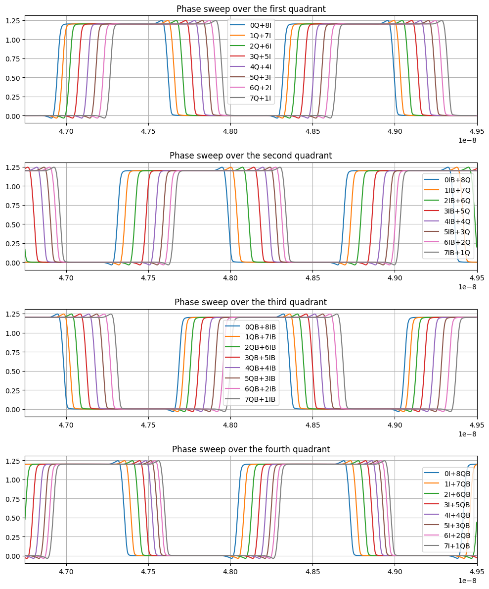
    </td>
  </tr>
  <tr>
    <!-- Columna 2, Fila 2: Segunda imagen cuadrada -->
    <td align="right" valign="top" style="border: none; padding-top: 10px;">
      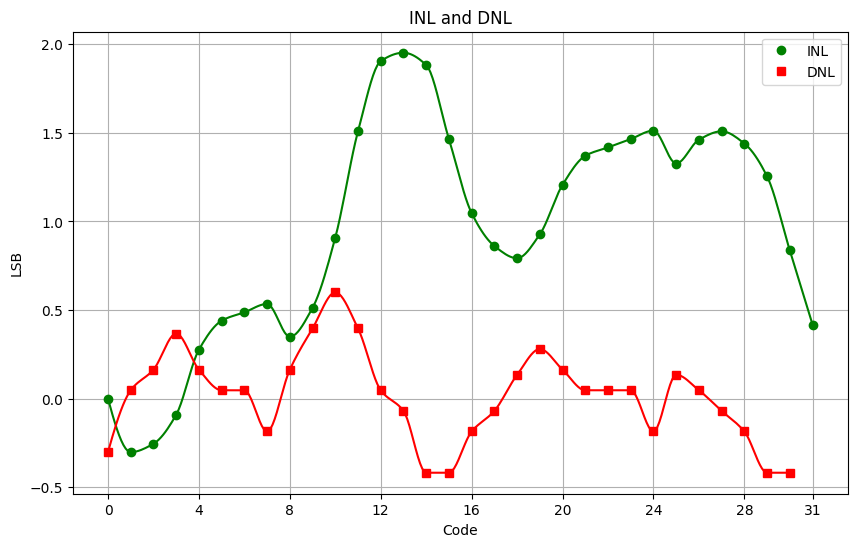
    </td>
  </tr>
</table>

| Verification Parameter | Value | Unit |
| :--- | :---: | :---: | 
| **VDD Voltage** | 1.2 | V |
| **AVG current consumption\*** | 679 | uA |
| **Peak current consumption\*** | 2.62 | mA |
| **Clock period** | 1375 | ps |
| **Clock frequency** | 727.27 | MHz |
| **Clock I phase** | 0 | ° |
| **Clock Q phase** | 90 | ° |
| **Clock IB phase** | 180 | ° |
| **Clock QB phase** | 270 | ° |
| **Max. DNL** | 0.6 | LSB | 
| **Max. INL** | 1.95 | LSB | 

> \* The measured current covers the consumption of both the 8xPI and the digital logic blocks

Even with ideal clocks, the `8I`, `8Q`, `8IB` and `8QB` phases can have mismatches, because the signal path of each clock is different across the `MUX_4_1_CDR` cell. Linearity is not maximized yet, since the initial goal was to maintain the INL below $\pm$ 0.5 LSB.

### 2.2. TB 2: Simulation results

To reproduce this results, simulate the `tb_8xPI_top_pex.sch` testbench to obtain the `tran_linearity_8xPI_top_pex.raw` output file. Afterwards, run the `results_tb_8xPI_top.ipynb` Jupyter Notebook to generate the curves.

<table border="0" align="center" style="border: none; border-collapse: collapse;">
  <tr>
    <!-- Columna 2, Fila 1: Primera imagen cuadrada -->
    <td align="right" valign="bottom" style="border: none; padding-bottom: 10px;">
      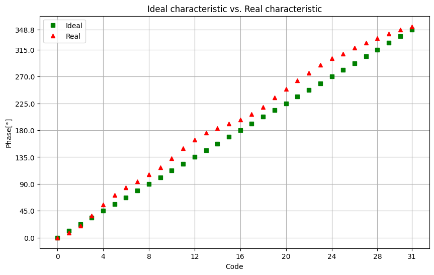
    </td>
    <!-- Columna 1: Imagen alargada verticalmente (Ocupa Filas 1 y 2) -->
    <td rowspan="2" align="left" valign="middle" style="border: none; padding-right: 10px;">
      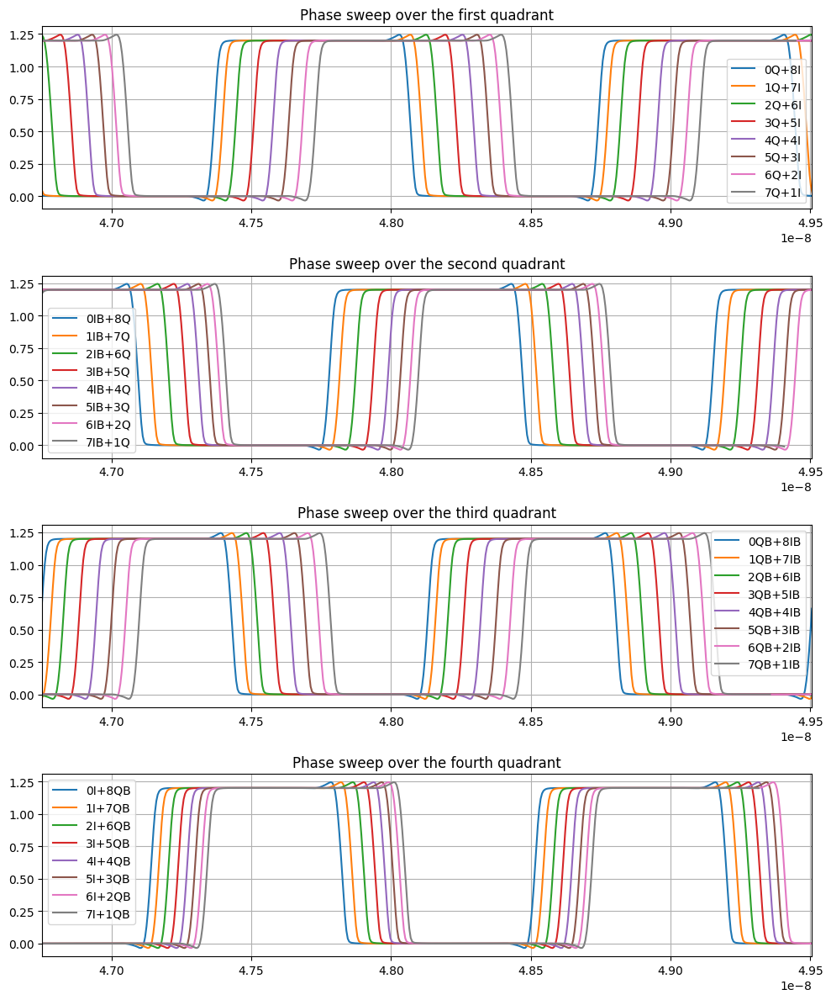
    </td>
  </tr>
  <tr>
    <!-- Columna 2, Fila 2: Segunda imagen cuadrada -->
    <td align="right" valign="top" style="border: none; padding-top: 10px;">
      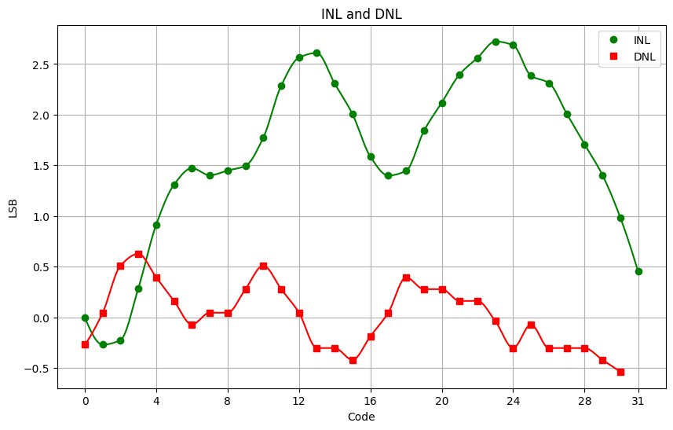
    </td>
  </tr>
</table>

| Verification Parameter | Value | Unit |
| :--- | :---: | :---: | 
| **VDD Voltage** | 1.2 | V |
| **AVG current consumption** | 6.86 | mA |
| **Peak current consumption** | 11.14 | mA |
| **Clock period** | 1376.43 | ps |
| **Clock frequency** | 726.52 | MHz |
| **Clock I phase\*** | 0 | ° |
| **Clock Q phase\*** | 100.64 | ° |
| **Clock IB phase\*** | 182.61 | ° |
| **Clock QB phase\*** | 282.64 | ° |
| **Max. DNL** | 0.63 | LSB | 
| **Max. INL** | 2.72 | LSB | 

> \* Phases between clocks were measured in `tb_clock_gen_pex.sch`

Power consumption in this testbench arises because of the Ring Oscillator (RO) integration. Linearity is degraded because of the RO intrinsic phase error.

---

## 3. Hardware Verification Platform Characterization

This section presents the post-layout characterization results for the key building blocks comprising the **Hardware Verification Platform**: the Ring Oscillator, the Divide-by-8 Frequency Divider, and the Output Pad Driver. These sub-systems ensure reliable clock generation, on-chip frequency division, and off-chip signal integrity.

#### Ring Oscillator Frequency Tuning
The multi-phase Ring Oscillator core was evaluated across control voltage variations to assess its frequency tuning behavior. The control supply voltage was swept from $0.85\text{ V}$ to $0.95\text{ V}$ in $10\text{ mV}$ steps, and the resulting oscillation frequency was recorded at each operating point.

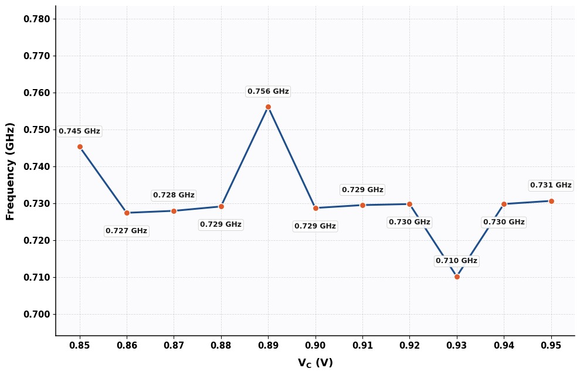

As can be seen, the frequency can vary with control voltage, but not by a significant amount.

#### Frequency Divider Propagation Delay & Skew
The post-layout transient simulation confirms that the propagation delay (skew) introduced by the frequency divider remains constant regardless of the relative phase state of the high-frequency input clock. Consequently, the time-domain linearity and phase progression pattern generated by the Phase Interpolator are preserved. While the total phase scale reduces proportionally in the phase domain due to the 8× frequency reduction, the absolute temporal delay between discrete steps remains unchanged.

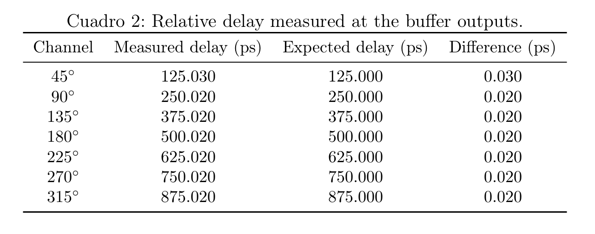

#### Output Pad Driver & Load Capacitance

To ensure signal integrity when driving external test equipment or pad loads at downscaled frequencies (~100 MHz), the output buffer strength was evaluated under varying capacitive loads. The transient simulation compares the ideal input signal against the output waveforms across a capacitive load sweep ranging from $1\text{ pF}$ to $10\text{ pF}$ in $1\text{ pF}$ steps.        
As shown in the figure below, signal degradation increases proportionally with load capacitance. Based on edge slew rate, **$4\text{ pF}$ was established as the maximum acceptable load capacitance** to maintain robust signal integrity and sharp transitions at 100 MHz.

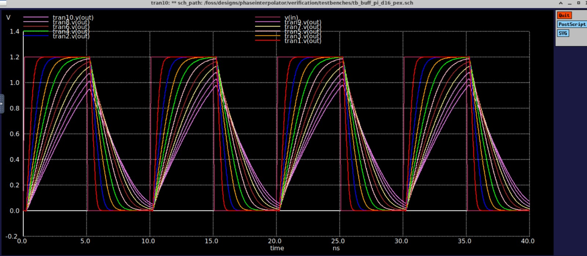

