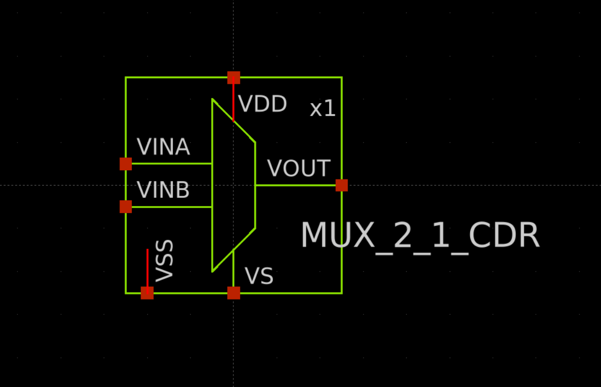
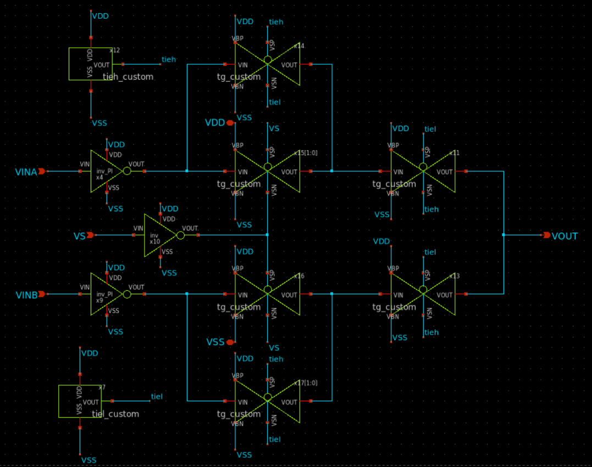
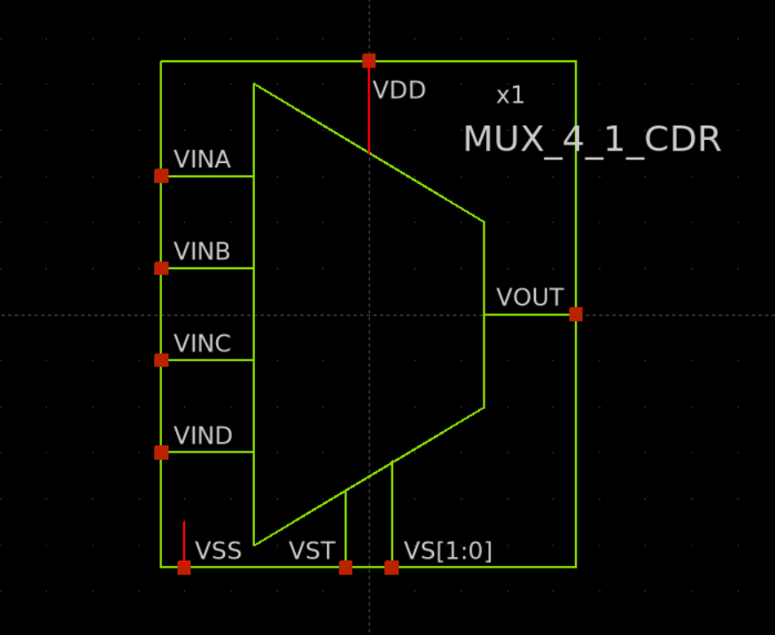
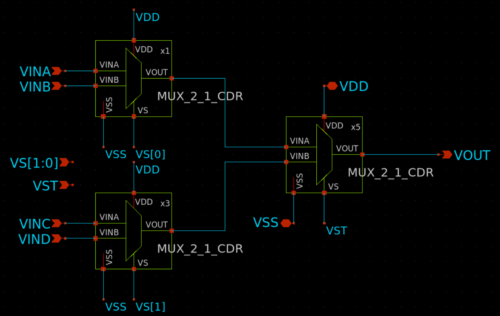

# IHP__CDR4176: 5-Bit 4-Quadrant Phase Interpolator (PI) IP in IHP SG13G2 Technology

[](https://www.ihp-microelectronics.com)
[](#5-eda-toolchain--flow)

This repository contains the full design, simulation setup, and layout files for an open-source **5-Bit 4-Quadrant Phase Interpolator (PI)** IP developed in the **IHP SG13G2** 130 nm BiCMOS technology node. 

The project was developed within the framework of the **UNIC-CASS 2025** program, with the objective of submitting the design for the **March 2026 tapeout**.

The project also includes an integrated hardware-based verification platform consisting of an **4-phase Ring Oscillator** and a **frequency divider** to facilitate full-chip verification and characterization.

Developer team:
* Víctor Muñoz  - Universidad Nacional del Sur (Argentina)
* Agustina Trabichet  - Universidad Nacional del Sur (Argentina)
* Pablo Dominguez  - Universidad Nacional de San Luis (Argentina)
* Valentín Ramirez - Universidad Nacional de Cordoba (Argentina)
* Macarena Gonzalez - Universidad Nacional de Cordoba (Argentina)

All of them are supported by [Fundación Fulgor](https://www.fundacionfulgor.org.ar/sitio/index.php). We extend our sincere gratitude to everyone at the institution whose collaboration made this project possible.

---

## Table of Contents
- [1. IP Functionality Overview](#1-ip-functionality-overview)
- [2. Principle of Operation](#2-principle-of-operation)
- [3. Block-Level Architecture and Specifications](#3-block-level-architecture-and-specifications)
- [4. Hardware Verification Platform](#4-hardware-verification-platform)
- [5. EDA Toolchain & Flow](#5-eda-toolchain--flow)
- [6. Directory Structure](#6-directory-structure)
- [7. Acknowledgments](#7-acknowledgments)

---

## 1. IP Functionality Overview

The core Intellectual Property (IP) is a **5-bit 4-Quadrant digitally controlled Phase Interpolator (PI)**. Its primary functionality is to generate an output clock signal whose phase is a weighted intermediate phase between $0^\circ$ and $348.75^\circ$.

To achieve full $360^\circ$ coverage across all 4 quadrants, the Phase Interpolator requires four input reference clock signals with quadrature phase shifts at $0^\circ$, $90^\circ$, $180^\circ$, and $270^\circ$. 

The 5-bit control word enables selection among $32$ ($2^5$) discrete phase states distributed evenly across the entire clock period, achieving a step resolution of $11.25^\circ$ per code step across all four quadrants.

* **Core Target Design:** 5-bit 4-Quadrant Phase Interpolator.
* **Hardware Platform Verification:** 4-Phase ring oscillator and frequency divider by 8.
* **Input Clocks:** Four quadrature reference clock signals ($CLK_{0^\circ}$, $CLK_{90^\circ}$, $CLK_{180^\circ}$, $CLK_{270^\circ}$). All of them are generated by the ring oscillator.
* **Phase Range:** $0^\circ$ to $348.75^\circ$ full-range rotation.
* **Phase Step Resolution:** $11.25^\circ$ ($360^\circ / 32$).
* **Digital Control:** 5-bit control word ($D[4:0]$) mapped to 32 fine-delay steps. 
* **Phase Mapping:** `5{1'b0}` $\to 0^\circ$, `5{1'b1}` $\to 348.75^\circ$ 
* **Target Applications:** Clock and Data Recovery (CDR) loops, high-speed SerDes receivers, and fine clock phase alignment in PLLs.

> **Note**
> Because of the frequency divider, the phase range measurable at the output will be between $0^\circ$ to $43.6^\circ$ ($\approx 348.75^\circ / 8$). The frequency division is neccesary because of IO Pads bandwith issues. 

---

## 2. Principle of Operation

Phase interpolation within each quadrant operates in the voltage/current domain by performing a weighted summation of two input clocks ($CLK_A$ and $CLK_B$) that share a $90^\circ$ phase difference.

The summation is realized by means of 8 multiplexers (`MUX_2_1_CDR`) with their outputs tied to a common node, which feeds an inverter chain. Driven by a 3-bit thermometer code, each multiplexer is configured to route either $CLK_A$ or $CLK_B$, achieving a weighted current charge/discharge of the node. This architecture enables phase interpolation across 8 discrete steps per quadrant, ranging from $8CLK_A$ to $1CLK_A + 7CLK_B$. The symbol and schematic for the `MUX_2_1_CDR` cell are shown below:

<p align="center">
  &nbsp;&nbsp;&nbsp;
</p>


The input signals $CLK_A$ and $CLK_B$ are dynamically selected from one of the four quadrature clock pairs: $0^\circ\text{--}90^\circ$, $90^\circ\text{--}180^\circ$, $180^\circ\text{--}270^\circ$, or $270^\circ\text{--}0^\circ$. This quadrant selection is made with `MUX_2_1_CDR` multiplexers and controlled by the remaining two bits of the 5-bit control word, achieving full $360^\circ$ phase rotation across all four quadrants.

This structural arrangement of `MUX_2_1_CDR` cells forms a higher-level 4-to-1 multiplexer block (`MUX_4_1_CDR`), which integrates three internal instances: two input-stage multiplexers route the appropriate quadrature clocks ($CLK_A$ and $CLK_B$) based on the quadrant selection bits, while the third instance performs the weighted current summation directly onto the common output node. The symbol and schematic for the `MUX_4_1_CDR` cell are shown below:

<p align="center">
  &nbsp;&nbsp;&nbsp;
</p>

The tailored sizing and optimization of the custom `MUX_2_1_CDR` cell play a critical role in overall performance, directly influencing phase interpolation linearity, inter-quadrant symmetry, and circuit bandwidth.

---


## 3. Block-Level Architecture and Specifications

The IP architecture is divided into three functional stages: Digital Control Decoding, Core Interpolator Cell, and Output Buffering.

### 3.1 Digital Control & Decoding Unit

The primary objective of this blocks is to decode the 5-bit input control word and generate the required internal control signals to sweep the output phase sequentially from $0^\circ$ to $348.75^\circ$ as the input binary code counts up from `5'b00000` to `5'b11111`.

To guarantee monotonic phase progression across all four quadrants, the digital control unit comprises two main sub-blocks:

1. **Thermometer Decoder `3to7_deco_v2`:** Converts the 3 LSBs into a 7-bit thermometer code to control the current-steering summation in the `MUX_2_1_CDR` matrix within each quadrant.
2. **Quadrant & Direction Control Logic `8xPI_logic`:** Uses the 2 MSBs to select the appropriate quadrature clock pair ($0^\circ\text{--}90^\circ$, $90^\circ\text{--}180^\circ$, $180^\circ\text{--}270^\circ$, or $270^\circ\text{--}0^\circ$). Additionally, it dynamically adapts/inverts the thermometer decoding sequence across adjacent quadrants to ensure that a continuous, ascending binary count always yields an ascending phase output step.

Since the primary requirement for these blocks is to correctly implement the digital logic, the circuit was designed almost entirely using minimum-sized transistors.

### 3.2. Current-Steering Phase Interpolator Core `8xPI`

The primary objective of this block is to synthesize the final output clock signal with the desired interpolated phase, using the four quadrature reference clocks ($CLK_{0^\circ}$, $CLK_{90^\circ}$, $CLK_{180^\circ}$, $CLK_{270^\circ}$) and the control signals generated by the digital logic.

The specifications and trade-offs associated with these blocks are:

* **Phase Linearity (INL & DNL):** Linearity is the primary design metric for the interpolator core. The output phase accuracy across all 32 code steps is characterized using Integral Nonlinearity (INL) and Differential Nonlinearity (DNL) metrics. Detailed measurements and performance plots are available in [`datasheet.md`](./datasheet.md).
* **Bandwidth & Signal Integrity:** Circuit bandwidth is another critical performance parameter that directly trades off with phase linearity. While bandwidth was not explicitly quantified in numerical sweeps, careful transistor sizing and layout optimization were performed to ensure signal integrity and prevent excessive waveform degradation at the Ring Oscillator's operating frequency.


### 3.3. Output Buffer / Squaring Stage


The primary objective of the output buffer stage is to present a high-input-impedance load to the phase interpolation node, thereby preventing load-induced distortion and preserving phase linearity. 

In addition, it shapes the interpolated waveform to restore sharp signal transitions, providing higher bandwidth and enhanced drive strength to properly drive external loads or subsequent processing blocks.

---

## 4. Hardware Verification Platform

To validate the Phase Interpolator in a real physical silicon environment without requiring high-frequency external signal generators, a custom **Hardware Verification Platform** was implemented on-chip alongside the PI core:

1. **4-Phase Ring Oscillator:** Generates stable multi-phase internal clock signals ($0^\circ, 90^\circ, 180^\circ, 270^\circ$) operating at approximately **730 MHz** to natively drive the Phase Interpolator inputs on-chip.
2. **Divide-by-8 Frequency Divider:** Downscales the high-frequency interpolated output clock to approximately **90 MHz**.
3. **Output Buffering:** Drives the off-chip load by boosting the signal's drive capability, ensuring sufficient current drive to interface with the output I/O pad capacitance without corrupting the signal waveform at 90 MHz.

Brief simulation results validating the feasibility and performance of this verification platform are available in datasheet.md.

> **Design Consideration on the Frequency Divider:**
> The frequency divider was included **exclusively to bypass the severe bandwidth limitations of the output I/O pads**, which are incapable of passing the full 730 MHz fundamental signal off-chip. 
> 
> While frequency division preserves the absolute time delay ($\Delta t$) of the interpolated clock steps, it compresses the equivalent relative phase shift at the divided output frequency ($\Delta \Phi_{div} = \Delta \Phi / 8$). Although this trade-off increases characterization complexity during physical phase measurements, post-layout testing confirmed that operating without frequency division was impossible due to output pad attenuation.
---

## 5. EDA Toolchain & Flow

This project was developed entirely using open-source EDA tools tailored for the **IHP SG13G2** process:

| Step / Task | Tool Used | Description |
| :--- | :--- | :--- |
| **Schematic & Netlist** | **Xschem** | Used for schematic capture and spice netlist generation. |
| **Circuit Simulation** | **Ngspice** | Performed transient and corner simulations. |
| **Layout Editing** | **KLayout** | Used for physical layout placement, routing, and DRC/LVS checks. |
| **Parasitic Extraction** | **Magic** | Used for layout parasitic extraction (PEX) to enable post-layout simulations. |
| **Data Post-Processing** | **Python** | Custom scripts (using `NumPy`, `Matplotlib`, `Pandas`) to process Ngspice output data, measure zero-crossings, and plot DNL/INL curves. |

---

## 6. Directory Structure

```
📁 IHP__CDR4176/
├── 📁 CDR4176-main/
│   ├── 📁 layout/
│   │   ├── 📁 def/
│   │   ├── 📁 klayout/
│   │   ├── 📁 lef/
│   │   └── 📁 magic/
│   ├── 📁 model/
│   │   ├── 📁 spice/
│   │   └── 📁 verilog-A/
│   ├── 📁 netlist/
│   │   ├── 📁 layout/
│   │   ├── 📁 pex/
│   │   ├── 📁 rcx/
│   │   └── 📁 schematic/
│   ├── 📁 schematic/
│   │   ├── 📁 qucs-s/
│   │   └── 📁 xschem/
│   ├── 📁 testbenches/
│   │   ├── 📁 ac/
│   │   │   ├── 📁 qucs-s/
│   │   │   └── 📁 xschem/
│   │   ├── 📁 corners/
│   │   │   ├── 📁 qucs-s/
│   │   │   └── 📁 xschem/
│   │   ├── 📁 noise/
│   │   │   ├── 📁 qucs-s/
│   │   │   └── 📁 xschem/
│   │   └── 📁 tran/
│   │       ├── 📁 qucs-s/
│   │       └── 📁 xschem/
│   ├── 📁 timing/
│   ├── 📁 verification/
│   │   ├── 📁 drc/
│   │   └── 📁 lvs/
│   └── README.md
├── 📁 dependencies/
├── 📁 doc/
│   ├── Datasheet.md
│   ├── info.json
│   ├── Specification.md
│   └── TRL-Mixed-Signal-IP.md
├── 📁 measurements/
│   └── 📁 v.1.0.0/
├── 📁 release/
│   └── 📁 v.1.0.0/
│       ├── 📁 doc/
│       ├── 📁 gds/
│       ├── 📁 netlist/
│       └── ReleaseNote.md
└── README.md
```

> **Note on Project Directory Structure:**  
> Due to the modular nature and the number of submodules comprising this design, dedicated subdirectories were created within each primary tool folder (`xschem/`, `klayout/`, etc.) to ensure a clean, scalable, and organized repository structure.

## 7. Acknowledgments

On behalf of the entire team, we would like to express our special gratitude to **Fundación Fulgor** and all the individuals who comprise it. It is through their continuous collaboration and support that this project has been made possible. 

In particular, we would like to extend our sincere appreciation to:
* Juana Pucheta - Universidad Nacional de Cordoba (Argentina) 
* Genaro Trucchi - Universidad Nacional de Cordoba (Argentina)
* Agustín Mendes Rosa - Universidad Nacional de Cordoba (Argentina)
* Mateo Buteler - Universidad Nacional de Cordoba (Argentina)

Additionally, we extend our heartfelt thanks to **Luighi Viton-Zorilla** [@LuighiV](https://github.com/LuighiV) for his tireless work on achieving a seamless top-level integration in record time.